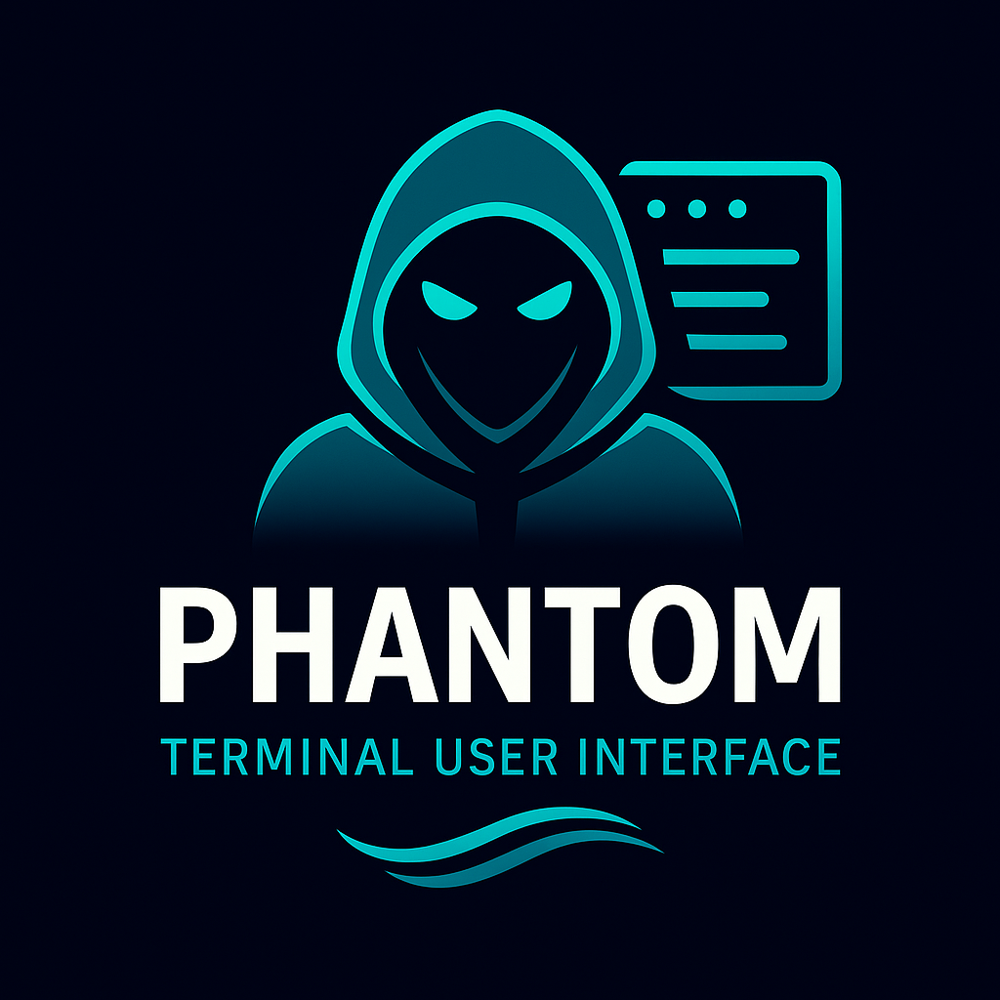

# 👻 Phantom — The Next-Gen TUI Framework for Zig

<p align="center">
  
</p>

[](https://ziglang.org/)
[](https://github.com/ghostkellz/phantom)
[](https://github.com/ratatui-org/ratatui)
[](https://ziglang.org/)

---

**Phantom** is a production-ready TUI (terminal user interface) framework for Zig — inspired by Ratatui, built from the ground up for Zig 0.16+ with comprehensive widgets, advanced styling, and professional-grade reliability.

---

## ✨ Features

* 🚀 **Production Ready:** Stable API, comprehensive testing, memory-safe
* 🧩 **Rich Widget Library:** 20+ widgets from basic text to advanced package browsers
* 🎨 **Advanced Styling:** True colors, animations, themes with fluent builder API
* 🖱️ **Full Input Support:** Keyboard navigation, mouse events, focus management
* 📱 **Responsive Layouts:** Constraint-based layout system adapts to terminal size
* ⚡ **High Performance:** Efficient diff-based rendering, optimized memory usage
* 🧪 **Thoroughly Tested:** Comprehensive test suite with example applications
* 🔧 **Developer Friendly:** Complete documentation, migration guides, best practices
* 💻 **Zig 0.16+ Compatible:** Built for modern Zig with proper ArrayList API usage

---

## 🛠️ Quick Start

**Requirements:**

* **Zig v0.16+** (tested with 0.16.0-dev.164+bc7955306)
* Terminal with ANSI color support

```sh
git clone https://github.com/ghostkellz/phantom.git
cd phantom
zig build run
```

Or add to your project:

```bash
zig fetch --save https://github.com/ghostkellz/phantom/archive/refs/tags/v0.3.10.tar.gz
```

Then in your `build.zig`:

```zig
const phantom_dep = b.dependency("phantom", .{ .target = target, .optimize = optimize });
const phantom_mod = phantom_dep.module("phantom");
exe.root_module.addImport("phantom", phantom_mod);
```

---

## 👾 Example Usage

### Basic Application
```zig
const phantom = @import("phantom");

pub fn main() !void {
    var gpa = std.heap.GeneralPurposeAllocator(.{}){};
    defer _ = gpa.deinit();
    const allocator = gpa.allocator();
    
    // Create application
    var app = try phantom.App.init(allocator, .{
        .title = "👻 My Phantom App",
        .tick_rate_ms = 50,
        .mouse_enabled = true,
    });
    defer app.deinit();
    
    // Add styled text (v0.3.10 uses instance methods)
    const text = try phantom.widgets.Text.initWithStyle(
        allocator,
        "Hello, Phantom! 👻",
        phantom.Style.default().withFg(phantom.Color.bright_cyan).withBold()
    );
    try app.addWidget(&text.widget);
    
    // Add interactive list
    const list = try phantom.widgets.List.init(allocator);
    try list.addItemText("🚀 Production Ready");
    try list.addItemText("🧩 Rich Widget Library");
    try list.addItemText("🎨 Advanced Styling");
    list.setSelectedStyle(
        phantom.Style.default().withFg(phantom.Color.white).withBg(phantom.Color.bright_blue)
    );
    try app.addWidget(&list.widget);
    
    // Run application
    try app.run();
}
```

### Widget Library (v0.3.10)
- **Core Widgets**: Text, Block, Container, List, Button, Input, TextArea
- **Data Display**: Table, ProgressBar, TaskMonitor, SystemMonitor  
- **Advanced**: StreamingText, CodeBlock, Dialog, ContextMenu
- **Specialized**: NetworkTopology, PackageBrowsers, CommandBuilder

### Styling System
- **Colors**: 16 basic + 16 bright + RGB true color + 256-color palette
- **Attributes**: Bold, italic, underline, strikethrough, dim, reverse, blink
- **Fluent API**: `Style.default().withFg(color).withBold().withBg(bg_color)`
- **Animations**: Built-in progress animations and typing effects

---

## 📚 Documentation & Examples

* **[📋 Complete Documentation](DOCS.md)**: Comprehensive guide with all features
* **[🔧 API Reference](API.md)**: Detailed API documentation for all widgets
* **[🚀 Integration Guide](docs/PHANTOM_INTEGRATION.md)**: Step-by-step integration instructions
* **[🎯 Feature Guide](docs/FEATURES.md)**: Detailed feature overview and API guide
* **Example Applications**: 6 complete demo applications in `examples/`
  - `simple_package_demo` - Package manager progress tracking
  - `zion_cli_demo` - Advanced Zig library management
  - `ghostty_performance_demo` - System performance monitoring
  - `crypto_package_demo` - Blockchain package browser
  - `reaper_aur_demo` - Arch Linux AUR dependency manager
  - `package_manager_demo` - Universal package browser
  - `comprehensive_demo` - All widgets showcase

---

## 🏆 Version History & Roadmap

### ✅ v0.3.10 (Current) - Production Ready
* **Full Zig 0.16+ Compatibility**: Updated ArrayList API, memory management
* **20+ Professional Widgets**: Complete widget ecosystem for any TUI app
* **Advanced Styling System**: True colors, animations, fluent API
* **Comprehensive Documentation**: Complete guides, API reference, examples
* **Production Testing**: Memory-safe, performance-optimized, thoroughly tested

### ✅ v0.3.3 - Build System Optimization
* **Conditional Compilation**: Build presets for optimal binary sizes
* **Size Optimization**: Basic preset ~24MB, full preset ~100MB
* **Demo Applications**: 6 complete working examples
* **Zig 0.16 Compatibility**: Updated for latest Zig APIs

### ✅ v0.3.2 - Polish & Refinement
* Enhanced widget library with specialized components
* Improved event handling and focus management
* Better layout system with responsive design

### ✅ v0.3.1 - Advanced Features
* StreamingText widget for AI chat applications
* TaskMonitor for package manager integration
* CodeBlock with syntax highlighting

### ✅ v0.3.0 - Major Expansion
* Comprehensive widget library (15+ widgets)
* Advanced input handling (mouse, keyboard, focus)
* Professional styling system

### 🚧 v0.4.0 - Planned Features
* **Async Integration**: Non-blocking I/O with zsync runtime
* **Plugin System**: Custom widget development framework  
* **Theme Engine**: Built-in themes and theme switching
* **Performance Profiler**: Built-in performance analysis tools
* **Accessibility**: Screen reader support and accessibility features

---

## 🤝 Contributing

Phantom is actively maintained and welcomes contributions! Here's how you can help:

* **🐛 Bug Reports**: Found an issue? [Open an issue](https://github.com/ghostkellz/phantom/issues)
* **💡 Feature Requests**: Have an idea for a new widget or feature?
* **📖 Documentation**: Help improve guides, examples, or API docs
* **🧩 Widget Development**: Create new widgets for the ecosystem
* **🧪 Testing**: Add tests or test on different platforms
* **⭐ Star the Project**: Show your support and help others discover Phantom

See our contributing guidelines for code style, testing requirements, and development setup.

---

## 👻 Built with next-gen Zig by [GhostKellz](https://github.com/ghostkellz)

